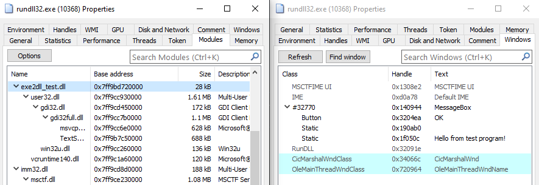

+++
date = '2025-07-01'
draft = false
title = 'Converting Exes to DLLs'

[taxonomies]
tags = ['windows', 'rev']
+++

If you’ve worked with Windows applications, you’re likely familiar with EXE (executable) and DLL (dynamic link library) files. While these file types serve different purposes, they share a common underlying structure called **PE (Portable Executable)**. This shared structure is what makes it technically possible to convert an EXE into a DLL.

This process is mainly educational—it’s a practical way to learn about the PE format, binary structure, and Windows internals.

In this post, we'll cover the key differences between EXEs and DLLs and walk through the technical steps to convert an EXE to a DLL.

## Key Differences Between EXEs and DLLs

Here are the main factors that distinguish DLLs from EXEs:

1. **DLL Flag**: The PE file header contains a flag called `IMAGE_FILE_DLL`. When this flag is set, Windows recognizes the file as a DLL.
2. **Export Directory**: DLLs contain an export directory with one or more entries. Each entry represents a function or variable that other programs can import and use.
3. **Entry Point Handling**: Both file types have entry points, but they function differently:
   - In EXEs: The entry point marks where program execution begins.
   - In DLLs: The entry point is called `DllMain` and is invoked when the DLL is loaded (attached) or unloaded (detached).
4. **Relocations**: This is a crucial difference. Relocations are used to adjust memory addresses when the binary is loaded at a different location than its preferred base address:
   - EXEs can run without relocations.
   - DLLs must have a relocation table to function properly. This is because DLLs can be loaded at any address in a process's memory space, depending on what other modules are already loaded. Without relocations, the DLL would fail to initialize if it can't be loaded at its preferred address.

## Converting EXE to DLL: The Technical Process

To convert an EXE into a DLL, we need to make the following modifications:

1. Verify that the EXE has a relocation table (this is a prerequisite).
2. Set the `IMAGE_FILE_DLL` flag in the PE file header.
3. Redirect the original entry point to a custom `DllMain` function.
4. Create an Export Directory that points to the original entry point.

## Implementation

Let's walk through the actual implementation of each step. Our code handles both 32-bit and 64-bit executables.

### 1. Preliminary Checks

Before starting the conversion, we need to verify two critical requirements:

```cpp
// Verify the input is a valid executable
if (!is_exe(buffer.data())) {
    std::cerr << "The file is not a valid EXE" << std::endl;
    return 1;
}

// Ensure relocations exist
if (!is_safe_to_convert(buffer.data())) {
    std::cerr << "The file is not safe to convert (missing relocations)" << std::endl;
    return 1;
}
```

The second check is particularly important because DLLs must be relocatable to function properly in different memory locations.

### 2. Setting the DLL Flag

The first modification is straightforward — we set the DLL flag in the PE file header:

```cpp
IMAGE_FILE_HEADER* file_header = peforge::get_file_header(buffer);
file_header->Characteristics |= IMAGE_FILE_DLL;
```

### 3. Finding and Using Code Caves

Before we can implement our `DllMain` function and set up the export directory, we need to find places to store our new data structures and code. We use "code caves" — unused spaces within the executable's sections that are large enough to hold our additions.

#### What is a Code Cave?

A code cave is an unused space between sections or within a section of the PE file. These spaces exist due to section alignment requirements and can be repurposed for our needs.

#### Finding Suitable Caves

```cpp
BYTE* code_cave = peforge::get_minimum_cave(buffer, 
                                          data_size + 1,  // +1 for separator
                                          &cave_size, 
                                          characteristics);
```

#### Cave Requirements

- Must be large enough for the data plus a separator byte
- Must have appropriate section characteristics (read/write/execute)
- For code (like `DllMain`), we need executable caves
- For data (names, addresses), we need readable caves

#### Inserting Data

```cpp
BYTE* data_location = code_cave + 1; // Skip one byte as separator
memcpy(data_location, data, data_size);
```

We need caves for several components:

- `DllMain` function code (needs executable permission)
- Export function name string
- DLL name string
- Function address array
- Name pointer array
- Ordinals array
- Export directory structure

Each insertion follows this pattern:

```cpp
BYTE* cave = insert_to_code_cave(buffer, size, data, data_size, characteristics);
if (!cave) {
    std::cerr << "Failed to find suitable cave" << std::endl;
    return false;
}
```

After inserting data into a cave, we convert the file offset to a Relative Virtual Address (RVA):

```cpp
DWORD offset = static_cast<DWORD>(cave - buffer);
DWORD rva = 0;
if (!peforge::offset_to_rva(buffer, size, offset, rva)) {
    std::cerr << "Failed to convert offset to RVA" << std::endl;
    return false;
}
```

This RVA conversion is crucial because PE files use RVAs in their data structures rather than file offsets.

### 4. Creating a DllMain Function

Now that we understand how to use code caves, we can create a minimal `DllMain` function that returns TRUE (1) to indicate successful initialization. The implementation differs slightly between 32-bit and 64-bit:

```cpp
// 32-bit version
BYTE dll_main_32[] = {
    0xB8, 0x01, 0x00, 0x00, 0x00,   // mov eax, 1
    0xC2, 0x0C, 0x00                // retn 0x0C
};

// 64-bit version
BYTE dll_main_64[] = {
    0xB8, 0x01, 0x00, 0x00, 0x00,   // mov eax, 1
    0xC3                            // retn
};
```

This machine code is inserted into one of the executable code caves we identified earlier. The key difference is in the return instruction: 32-bit DLLs need to clean up the stack (`retn 0x0C`), while 64-bit uses the simpler `ret`.

### 5. Updating the Entry Point

After creating our `DllMain` function, we need to perform a crucial step: redirecting the executable's entry point. This involves:

1. Saving the original entry point (OEP) for later use as our exported function:

```cpp
DWORD oep = peforge::get_entry_point(buffer);
```

2. Updating the PE header to point to our new `DllMain`:

```cpp
if (!peforge::update_entry_point(buffer, dll_main_rva)) {
    std::cerr << "Failed to update entry point" << std::endl;
    return false;
}
```

This redirection ensures that when the DLL is loaded, Windows will call our `DllMain` function first. The original entry point is preserved and will be exposed as the exported function that other programs can call.

### 6. Setting Up the Export Directory

The export directory is what makes the DLL's functions accessible to other programs. We create it in several steps:

1. First, we create the main export directory structure:

```cpp
IMAGE_EXPORT_DIRECTORY export_dir = {0};
export_dir.Name = dll_main_name_rva;          // DLL name
export_dir.Base = 1;                          // Starting ordinal number
export_dir.NumberOfFunctions = 1;             // We're exporting one function
export_dir.NumberOfNames = 1;                 // With one name
export_dir.AddressOfFunctions = functions_rva; // Points to function addresses
export_dir.AddressOfNames = names_rva;        // Points to function names
export_dir.AddressOfNameOrdinals = ordinals_rva; // Maps names to functions
```

2. We store the original entry point as the exported function's address. This allows other programs to call the original EXE's entry point as a function.

3. We create supporting arrays:
   - Function names array: Contains the name of our exported function
   - Function addresses array: Contains the RVA of the original entry point
   - Ordinals array: Maps between names and addresses (we use ordinal 0)

### 7. Updating PE Headers

Finally, we update the PE headers to point to our new export directory:

```cpp
IMAGE_DATA_DIRECTORY* export_dir_entry = peforge::get_directory_entry(buffer, IMAGE_DIRECTORY_ENTRY_EXPORT);
export_dir_entry->VirtualAddress = export_table_rva;
export_dir_entry->Size = sizeof(IMAGE_EXPORT_DIRECTORY);
```

## Using the Converter

The converter can be used from the command line like this:

```bash
exe2dll input.exe output.dll Start
```

Where:

- `input.exe` is the source executable
- `output.dll` is the name of the DLL to create
- `Start` is the name of the exported function (usually the original entry point)

The tool will verify the input file, perform the conversion, and create a new DLL with the specified exported function.

## Demo

Below are some screenshots to illustrate the process and results:

### 1. Running the Original EXE


*The original executable running as a standalone application.*

### 2. Running the Converted DLL via rundll32


*The converted DLL is executed using `rundll32`, calling the exported function.*

### 3. Inspecting the DLL in a PE Reader


*The converted DLL opened in a PE file reader, showing the new export directory and DLL flag.*

### 4. System Informer Showing the DLL Loaded



*System Informer confirms the DLL is loaded into the process space via `rundll32`.*

## Conclusion

Converting an EXE to a DLL involves understanding the PE file format, carefully modifying headers, redirecting entry points, and making use of code caves to insert new data. By following these steps, you can repurpose executables as DLLs and expose their functionality to other programs. I hope this walkthrough has clarified the process and inspired you to explore PE file manipulation further.

You can find the full source code in my [GitHub repository](https://github.com/sonx4444/exe2dll).

Happy hacking!
